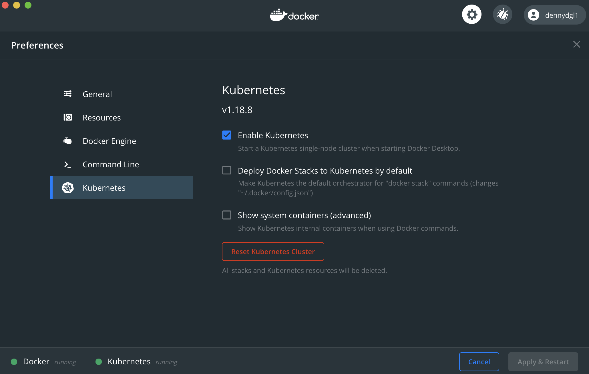

# Docker Desktop Minikube

If you choosed to follow this setup, you'll be using the Docker Desktop's embedded Minikube instance.

This is particular convenient if you are using an OS that supports Docker Desktop (ie: MacOS, Windows Pro).

To download and install Docker Desktop please follow the procedure showed [here](https://docs.docker.com/desktop/).

When installed, just open its Preferences and enable Kubernetes by flagging the corresponding option. Then, wait for Kubernetes to become **running** (at the bottom left):

