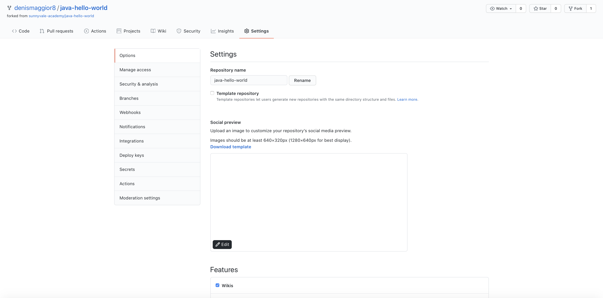
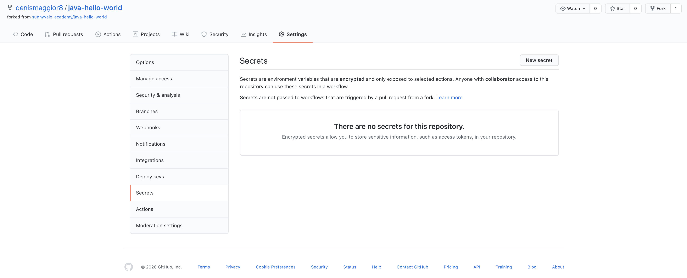

# Setup the application's CICD pipeline

## Prerequisites

- Having completed the lab [03 - Fork and clone the application repo](../labs/03-Fork_and_clone_the_application_repo/README.md)
- A valid DockerHub account

## Enable GitHub Actions

Using your browser go to **https://github.com/\<YOUR GITHUB ACCOUNT\>/java-hello-world** (please substitute the placeholder \<YOUR GITHUB ACCOUNT\> qith your GitHub account).

Click on "Actions" button on the top menu bar.

Click on the green button at the center of the page stating: "I understand my workflows, go ahead and enable them".

The GitHub Actions workflow is enabled.

## Create GitHub Secrets to be used by Actions workflow

In the top menu bar click **Settings**, then **Secrets** in the left menu.

The Secrets page opens:

Create two Secrets as per the following:

- DOCKER_USERNAME: containing your DockerHub username
- DOCKER_PASSWORD: containing your DockerHub password

GitHub will keep them secretly.

## Inspect the workflow

In your application's cloned repo, open the file **.github/workflows/deploy.yaml** and take time to understand the code.

For every tag that is pushed, the pipeline triggers so as to:

- build sources (Maven)
- test the application (JUnit)
- package the application (Maven)
- build the image (Docker)
- push the image (Docker Hub)