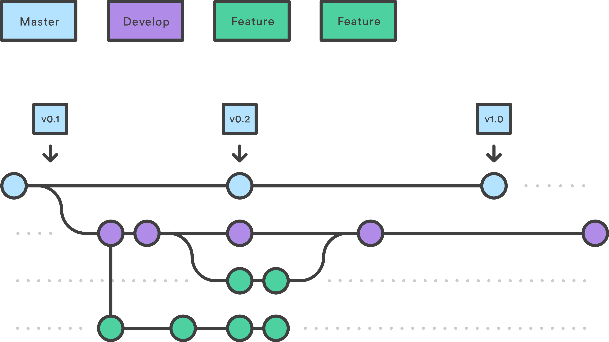
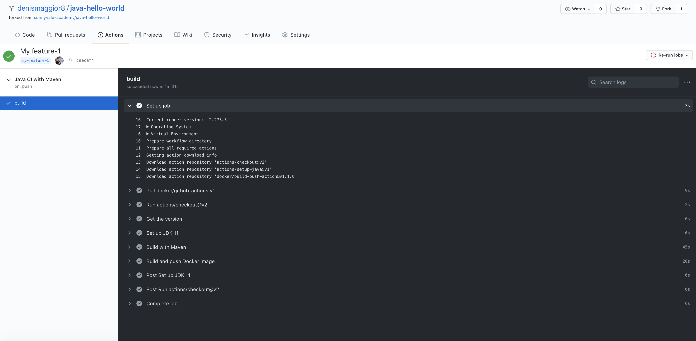
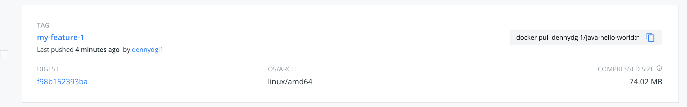

# Make an application feature and publish the Docker image

## Prerequisites

- Having completed the lab [03 - Fork and clone the application repo](../labs/03-Fork_and_clone_the_application_repo/README.md)

## Make an application feature (thus change the application in some way)

In this lab we will apply the "Feature Branch" Git branching strategy to let you "develop" a new application feature (thus change the application in some way).



When done, trigger the CI/CD pipeline by pushing a tag to origin.

## Switch to **development branch** and create your "Feature Branch"


Navigate your filesystem to the directory where you cloned the application's source code as required in the lab [03 - Fork and clone the application repo](../labs/03-Fork_and_clone_the_application_repo/README.md).

Then, switch to the **development** branch 

```console
$ git checkout development
Branch 'development' set up to track remote branch 'development' from 'origin'.
Switched to a new branch 'development'
```

and create your "Feature Branch".

```console
$ git checkout -b feature-1
Switched to a new branch 'feature-1'
```

## Develop a new application feature

Modify the the file **src/main/resources/application.yaml** and insert your preferred value to property **app.greeting** (choose among the following values):

- Hola
- Hi
- Hello
- Ciao

```console
$ sed -i 's/  greeting: \"\"/  greeting: \"Ciao\"/g' src/main/resources/application.yaml
```

```console
$ cat src/main/resources/application.yaml
app:
  greeting: "Ciao"

server:
  port: 8080
  host: 0.0.0.0
```

Now commit your change into **feature-1** branch.


```console
$ git add . && git commit -m "My feature-1"
[feature-1 c9ecaf4] My feature-1
 1 file changed, 8 insertions(+), 1 deletion(-)
```

## Merge into **development** branch

Checkout your **development** branch

```console
$ git checkout development
Switched to branch 'development'
Your branch is up to date with 'origin/development'.
```

and merge the **feature-1** into

```console
$ git merge feature-1
Updating 2b213b1..c9ecaf4
Fast-forward
 src/main/resources/application.yaml   | 2 +-
 1 file changed, 8 insertio
```

Your feature has been merged into **development** branch. 

## Make a release

Now, you are ready to make a release.

```console
$ export TAG=my-feature-1 && git tag $TAG && git push origin $TAG
Enumerating objects: 11, done.
Counting objects: 100% (11/11), done.
Delta compression using up to 4 threads
Compressing objects: 100% (6/6), done.
Writing objects: 100% (6/6), 621 bytes | 621.00 KiB/s, done.
Total 6 (delta 1), reused 0 (delta 0)
remote: Resolving deltas: 100% (1/1), completed with 1 local object.
To https://github.com/denismaggior8/java-hello-world.git
 * [new tag]         my-feature-1 -> my-feature-1
```

If everything went fine, you should see that the pipeline has been triggered by your tag and the job completed successfully



The corresponding Docker image has been published by your pipeline on Docker Hub




