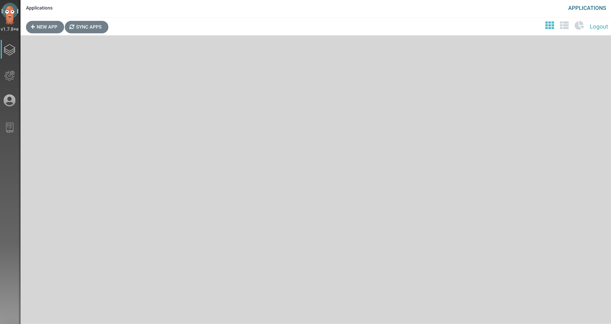

# Install ArgoCD on Kubernetes

## Prerequisites

- Having completed the lab [02 - Provision Kubernetes](labs/02-Provision_Kubernetes/README.md)
- Having the **kubectl** command already configure to point to your Kubernetes master node (or Minikube instance)

## Install ArgoCD

Create the ArgoCD dedicated namespace

```console
$ kubectl create ns argocd
Namespace "argocd" created
```

```console
$ kubectl apply -n argocd -f https://raw.githubusercontent.com/argoproj/argo-cd/stable/manifests/install.yaml
```

The previous command has a very long output, to check if the installation has finished, please type:

```console
$ kubectl get all -n argocd
NAME                                                  READY   STATUS    RESTARTS   AGE
pod/argocd-application-controller-75b4dcd7bb-tlpdx    1/1     Running   122        2d21h
pod/argocd-dex-server-996685b6d-8hlzq                 1/1     Running   2          2d21h
pod/argocd-notifications-controller-87fb87c8c-zk8ts   1/1     Running   1          40h
pod/argocd-redis-99fb49846-ql876                      1/1     Running   2          2d21h
pod/argocd-repo-server-5c76bd686b-hs6zs               1/1     Running   2          2d21h
pod/argocd-server-67885bdcff-zmtvx                    1/1     Running   2          2d21h

NAME                            TYPE        CLUSTER-IP      EXTERNAL-IP   PORT(S)                      AGE
service/argocd-dex-server       ClusterIP   10.99.229.123   <none>        5556/TCP,5557/TCP,5558/TCP   2d21h
service/argocd-metrics          ClusterIP   10.107.38.62    <none>        8082/TCP                     2d21h
service/argocd-redis            ClusterIP   10.106.11.136   <none>        6379/TCP                     2d21h
service/argocd-repo-server      ClusterIP   10.105.18.118   <none>        8081/TCP,8084/TCP            2d21h
service/argocd-server           ClusterIP   10.98.116.184   <none>        80/TCP,443/TCP               2d21h
service/argocd-server-metrics   ClusterIP   10.103.236.98   <none>        8083/TCP                     2d21h

NAME                                              READY   UP-TO-DATE   AVAILABLE   AGE
deployment.apps/argocd-application-controller     1/1     1            1           2d21h
deployment.apps/argocd-dex-server                 1/1     1            1           2d21h
deployment.apps/argocd-notifications-controller   1/1     1            1           40h
deployment.apps/argocd-redis                      1/1     1            1           2d21h
deployment.apps/argocd-repo-server                1/1     1            1           2d21h
deployment.apps/argocd-server                     1/1     1            1           2d21h

NAME                                                        DESIRED   CURRENT   READY   AGE
replicaset.apps/argocd-application-controller-75b4dcd7bb    1         1         1       2d21h
replicaset.apps/argocd-dex-server-996685b6d                 1         1         1       2d21h
replicaset.apps/argocd-notifications-controller-87fb87c8c   1         1         1       40h
replicaset.apps/argocd-redis-99fb49846                      1         1         1       2d21h
replicaset.apps/argocd-repo-server-5c76bd686b               1         1         1       2d21h
replicaset.apps/argocd-server-67885bdcff                    1         1         1       2d21h
```

Make sure that all the Pods are running

## Test ArgoCD

By default ArgoCD is now published outside the cluster, to reach its user interface you have to create a port forward:

```console
$ kubectl port-forward svc/argocd-server -n argocd 4000:443
Forwarding from 127.0.0.1:4000 -> 8080
Forwarding from [::1]:4000 -> 8080
```

Then, using your browser, go to [https://localhost:4000](https://localhost:4000)

The ArgoCD web interface opens:

.


