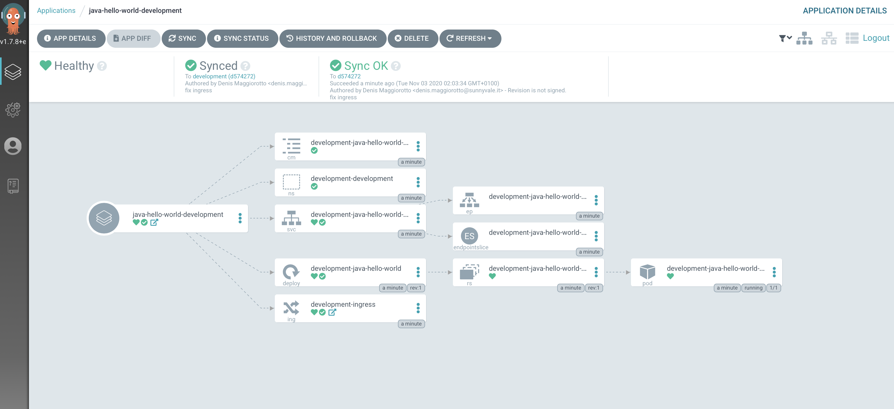

# Create the first ArgoCD application

## Prerequisites

- Having completed lab [09 - Install ArgoCD on Kubernetes](labs/09-Install_ArgoCD_on_Kubernetes/README.md)
- Having the **kubectl** command already configure to point to your Kubernetes master node (or Minikube instance)
- Having installed the ArgoCD CLI (more at [https://argoproj.github.io/argo-cd/cli_installation/](https://argoproj.github.io/argo-cd/cli_installation/))
- Having setup the ArgoCD port forward (please have a look of the previous lab)

## Create the first ArgoCD application

An ArgoCD application is basically an instance of your application in a specific environment (in our case, the  environment is a Kubernates namespace).

There are two options for creating CD deployment which are either via CLI or UI. We are going to the CLI for as it is more declarative.

Login with the CLI (by default, the ArgoCD admin password is set as the name of the **server** pod)

```console
$ argocd login localhost:4000 --insecure --username admin --grpc-web  --password $(kubectl get po -n argocd | grep argocd-server | cut -d " " -f 1)
'admin' logged in successfully
Context 'localhost:4000' updated
```

Create the app

```console
$ argocd app create java-hello-world-development \
    --repo https://github.com/<YOUR GITHUB ACCOUNT>/java-hello-world-config.git \
    --path overlays/development \
    --dest-server https://kubernetes.default.svc \
    --dest-namespace development \
    --auto-prune \
    --self-heal \
    --sync-policy auto \
    --sync-option CreateNamespace=true
    --revision development 
application 'java-hello-world-development' created
```

Looking at the Web UI, if everything went fine you can see your application deployed on development namespace




## Test the application

```console
$ curl -s http://development.app.127-0-0-1.nip.io/greet   | jq 
{
  "message": "Hello World v.3.0\n from host development-java-hello-world-59dfb6b554-7bpjn! I'm running in development!"
}
```

The application running is the 3.0 version since we did not modify anything in the **java-hello-world-config** repo.