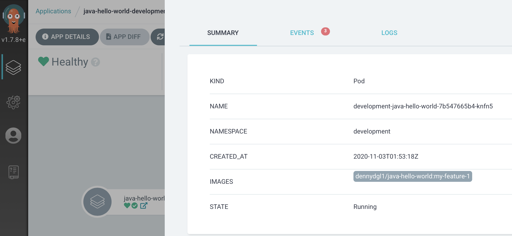

# Run your application version on Kubernates development environment

## Prerequisites

- Having completed lab [06 - Make an application feature and publish the Docker image](labs/06-Make_an_application_feature_and_publish_the_Docker_image/README.md)
- Having completed lab [08 - Fork and clone the application config repo](labs/08-Fork_and_clone_the_application_config_repo/README.md)
- Having completed lab [09 - Install ArgoCD on Kubernetes](labs/09-Install_ArgoCD_on_Kubernetes/README.md)

## Deploy your application version

To run this lab we will change the application version that Kustomize uses for the development environmnt. To do so, we will engage a typical GitOps worlflow.

Navigate your filesystem to the directory where you cloned the application's source code as required in the lab [08 - Fork and clone the application config repo](labs/08-Fork_and_clone_the_application_config_repo/README.md)

Checkout master branch

```console
$ git checkout master
Already on 'master'
Your branch is up to date with 'origin/master'.
```

Create your configuration branch

```console
$ git checkout -b my-config
Switched to a new branch 'my-config'.
```

Modify the application version in Kustomize **development** overlay

```console
$ perl -p  -i -e 's/  newTag: \"3.0\"/  newTag: \"my-feature-1\"/g' overlays/development/kustomization.yaml
```

Commit the modification

```console
$ git add . && git commit -m "my-feature-1"
[my-config dcfd8af] my-feature-1
 1 file changed, 1 insertion(+), 1 deletion(-)
```

Checkout **master** branch

```console
$ git checkout master
Switched to branch 'master'
Your branch is up to date with 'origin/master'.
```

Merge **my-config** branch into **master**

```console
$ git merge my-config
Updating 4592c18..dcfd8af
Fast-forward
 overlays/development/kustomization.yaml | 2 +-
 1 file changed, 1 insertion(+), 1 deletion(-)
```

Checkout **development** branch

```console
$ git checkout development
Branch 'development' set up to track remote branch 'development' from 'origin'.
Switched to a new branch 'development'
```

Merge **master** branch into **development**

```console
$ git merge master
 overlays/development/kustomization.yaml |   2 +-
```

Push the commit to **origin** **development**

```console
$ git push --set-upstream origin development
...
To https://github.com/denismaggior8/java-hello-world-config.git
   d574272..dcfd8af  development -> development
Branch 'development' set up to track remote branch 'development' from 'origin'.
```

Going back to ArgoCD web UI, you should see that the application version on development namespace changed to **dennydgl1/java-hello-world:my-feature-1**



